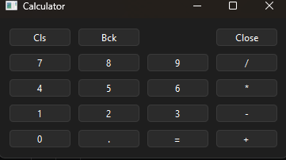
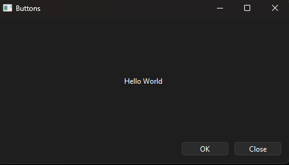
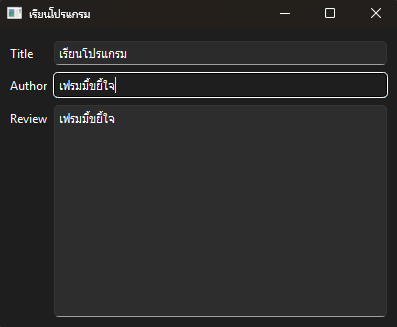
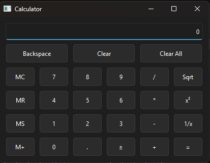

# learning_summer
# 🐍 PySide6 GUI Starter Examples
# LAB 30/4/2026

รวมชุดโค้ดตัวอย่างการสร้าง GUI ด้วยภาษา Python โดยใช้ **PySide6 (Qt for Python)** ตั้งแต่พื้นฐานการแสดงผล จนถึงการดึงข้อมูลเว็บและการจัดการ Event

## 🛠️ การติดตั้ง (Installation)

โปรเจกต์นี้จำเป็นต้องใช้ไลบรารี PySide6 คุณสามารถติดตั้งได้ผ่าน pip:
```bash
pip install PySide6
pip install PySide6-WebEngine
```
รายละเอียดตัวอย่างโค้ด
ในโปรเจกต์นี้ประกอบไปด้วยตัวอย่างพื้นฐานที่สำคัญ ดังนี้:

1. Basic Window & OOP 
การสร้างหน้าต่างโปรแกรมพื้นฐานด้วยโครงสร้างแบบ Class (Inheritance)

การกำหนดขนาดหน้าต่าง (resize) และชื่อโปรแกรม (setWindowTitle)

2. Layout Management
การใช้งาน QVBoxLayout เพื่อจัดวาง Widget แบบแนวตั้ง

การเพิ่มข้อความหลายชุดด้วย QLabel เข้าสู่ Layout

3. Interactive Widgets
การสร้างปุ่มกด QPushButton และการปรับแต่งฟอนต์ด้วย QFont

การเชื่อมต่อ Signal & Slot (เช่น การคลิกปุ่มเพื่อปิดโปรแกรม)

4. Web Content & HTML
Web View: การดึงหน้าเว็บไซต์มาแสดงผล (URL Loading)

Custom HTML: การเขียนโค้ด HTML เพื่อแสดงผลภายในแอป

Image Rendering: การอ่านไฟล์ภาพแบบ Binary และแสดงผลผ่าน WebEngine

5. Events & Dialogs
Close Event: การดักจับ Event เมื่อมีการปิดหน้าต่าง (closeEvent)

QMessageBox: การสร้างกล่องถาม-ตอบเพื่อยืนยันการออกจากโปรแกรม (Yes/No)


# LAB 5/5/2026

## LAB1

การสร้าง UI เครื่องคิดเลขพื้นฐาน โดยเน้นการฝึกใช้ QGridLayout เพื่อจัดวางปุ่มตัวเลขและเครื่องหมายคำนวณให้เป็นระเบียบตามแนวแถวและคอลัมน์

## LAB2

การใช้ Layout แบบซ้อนกัน (Nested Layouts) โดยใช้ QVBoxLayout จัดวางวิดเจ็ตในแนวตั้ง และ QHBoxLayout จัดวางปุ่ม OK/Close ในแนวนอน รวมถึงการใช้ addStretch() เพื่อดันปุ่มไปทางขวา

## LAB3

การสร้าง แบบฟอร์มกรอกข้อมูล ด้วย QFormLayout ซึ่งเหมาะสำหรับการจับคู่ "ป้ายชื่อ (Label)" กับ "ช่องกรอก (Input)" พร้อมตัวอย่างการเชื่อมต่อ Signal/Slot เพื่อเปลี่ยนชื่อ Title บาร์ตามข้อความที่พิมพ์

## LAB4

สร้าง UI เครื่องคิดเลขที่ซับซ้อนขึ้น มีการใช้ QLineEdit เป็นหน้าจอแสดงผล และใช้ addWidget แบบกำหนด row_span และ col_span เพื่อให้บางปุ่ม (เช่น Clear, Backspace) มีความยาวกว้างกว่าปุ่มปกติ